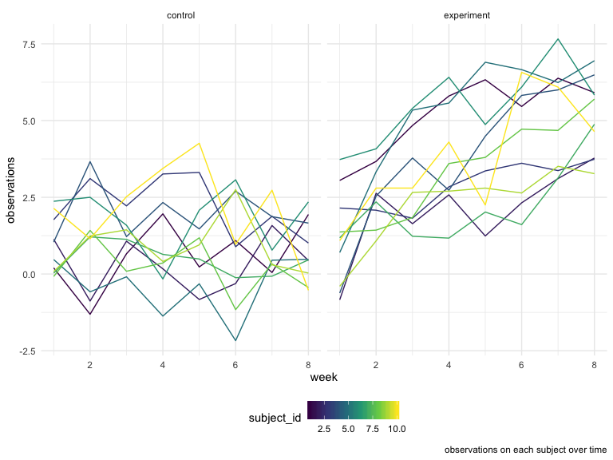

p8105\_hw5\_yy2912
================
Roxana Yan
03/11/2019

``` r
library(tidyverse)

set.seed(10)

iris_with_missing = iris %>% 
  map_df(~replace(.x, sample(1:150, 20), NA)) %>%
  mutate(Species = as.character(Species))
```

\#problem 1

``` r
fill_iris = function(x){
    if (is.numeric(x)) {
      x = replace_na(x, mean(x[!is.na(x)], na.rm= TRUE))}
      else if (is.character(x)) {
      x= replace_na(x, "virginica")
      }
    }
 
iris_filled = map_df(iris_with_missing, fill_iris) 
```

\#problem 2

``` r
longstudy=list.files(path= "./data")

 dataframe = data_frame(files=longstudy)%>% 
  mutate(data=map(files, ~read.csv(str_c("./data/", .x))))%>%
  unnest()%>%
 pivot_longer(
    week_1:week_8,
    names_to = "week",
    values_to = "observation"
 )%>%
 
   mutate(
    week=str_replace(week, "week_", ""),
    week=as.numeric(week),
    arm = substr(files, 1, 3),
    arm = recode(arm, "con" = "control",
                      "exp" = "experiment"),
    subject_id=substr(files,5,6),
    subject_id=as.numeric(subject_id))%>%

   select(-files)%>% 
select(arm,subject_id,week,observation)
```

\#spaghetti plot

``` r
dataframe %>% 
ggplot(aes(x = week, y = observation, group = subject_id, color = subject_id)) +
   geom_line() +facet_grid(. ~arm) + 
  labs(caption = "observations on each subject over time",
       x = "week",
    y = "observations")
```



\#from the graph, the weekly observation did not vary much as time went
by; however, in the experiment group, weekly observation increased as
time increased.

\#problem 3

``` r
set.seed(1)
```

``` r
sim_regression = function(n=30, beta0 = 2, beta1 = 0) {
  
  sim_data = tibble(
    xi1 = rnorm(n, mean = 0, sd = 1),
    yi = beta0 + beta1 * xi1 + rnorm(n, 0, 50)
  )
  
  ls_fit = lm(yi ~ xi1, data = sim_data)
  
    tibble(
    beta1_hat = broom::tidy(ls_fit)$estimate[2],
    p_value = broom::tidy(ls_fit)$p.value[2],
    alpha=0.05
  )
}
```

``` r
output = 
  rerun(10000, sim_regression(30, 2, 0)) %>% 
  bind_rows
```

``` r
beta1_list = list("beta1_1"  = 1, 
              "beta1_2"  = 2, 
              "beta1_3" = 3, 
              "beta1_4" = 4,
              "beta1_5"  = 5, 
              "beta1_6"  = 6)
output = vector("list", length = 6)

for (i in 1:6) {
  output[[i]] = rerun(10000, sim_regression(beta1_list[[i]])) %>% 
    bind_rows
}
```

``` r
sim_results = 
  tibble(beta1 = c(1, 2, 3, 4, 5, 6)) %>% 
  mutate(
    output_lists = map(.x = beta1, ~rerun(10000, sim_regression(beta1 = .x))),
    estimate_dfs = map(output_lists, bind_rows)) %>% 
  select(-output_lists) %>% 
  unnest(estimate_dfs)
```
